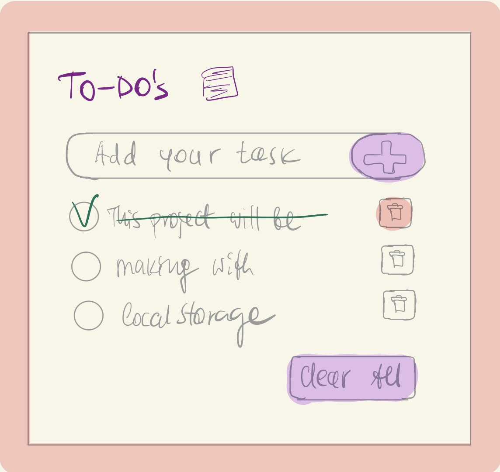

# To-Do's 26.02-07.03.2026
This plan shows the `intended approach` before starting coding.

## Overview

| `Date`       | `Todos`                      |
| ---------    | ----------------------       |
| 26.02        | Project started              |
| 27.02        | Layout implemented           |
| 28.02-06.03  | JS logic implemented         |
| 07.03        | Project finalized            |
 

## Mockup

## Procedure

### 26-27.02.2026
1. Create initial plan
2. Send plan to mentor & wait for feedback
3. Initialize repository
4. Build layout & push

### 28.02-07.03.2026
1. Implement add function
2. Implement delete item function
3. Implement clear all items function
4. Implement task done function

## Issues / Tasks

### 26-27.02.2026
- [Style with CSS flexbox](https://github.com/fortunatus-png/Todo-List/pull/1)

### 28.02-07.03.2026
- [Add new tasks](https://github.com/fortunatus-png/Todo-List/pull/9)
- [Delete task](https://github.com/fortunatus-png/Todo-List/pull/11)
- [Clear all tasks](https://github.com/fortunatus-png/Todo-List/pull/12)
- [Toggle task done](https://github.com/fortunatus-png/Todo-List/pull/10)
